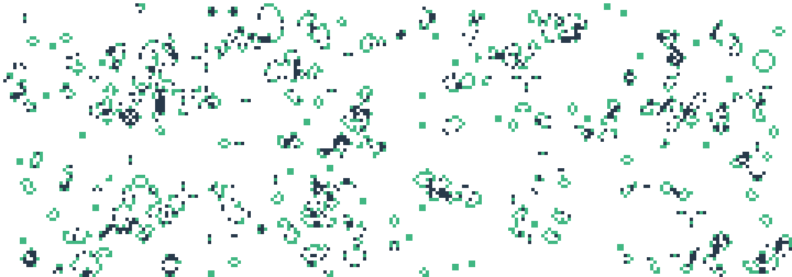

<div id="top"></div>

<p>
	
</p>

<br/>
<div align="center">
	<h2 align="center">GameOfLifeAction</h2>
	<p align="center">
		Github-Action to generate a Game of Life Image in your repository.
		<br/>
		<a href="https://github.com/SilenZcience/GameOfLifeAction/blob/main/GameOfLife/GameOfLife.py">
			<strong>Explore the code »</strong>
		</a>
		<br/>
		<br/>
		<a href="https://github.com/SilenZcience/GameOfLifeAction/issues">Report Bug</a>
		·
		<a href="https://github.com/SilenZcience/GameOfLifeAction/issues">Request Feature</a>
   </p>
</div>


<details>
	<summary>Table of Contents</summary>
	<ol>
		<li>
			<a href="#about-the-project">About The Project</a>
			<ul>
			<li><a href="#made-with">Made With</a></li>
			</ul>
		</li>
		<li>
			<a href="#getting-started">Getting Started</a>
		</li>
		<li><a href="#usage">Usage</a>
			<ul>
			<li><a href="#examples">Examples</a></li>
			</ul>
		</li>
		<li><a href="#license">License</a></li>
		<li><a href="#contact">Contact</a></li>
	</ol>
</details>

## About The Project

This Project generates a Game-of-Life image and saves it to a path of your choosing.
For each additional time, the programm is started, it will read in the image, update its cycle and save it again.
Furthermore it generates and updates an image, which will show the current iteration the game is in.
It will do so, for a dark-mode image, aswell as a light-mode image, which will then be displayed accordingly.

### Made With
[![Python][MadeWith-Python]](https://www.python.org/)
[![Numpy][MadeWith-Numpy]](https://numpy.org/)

<p align="right">(<a href="#top">back to top</a>)</p>

## Getting Started

Choose a folder(-structure), or create a new one, in which the Game-of-Life images should be stored.
<br/>
Within your ``README.md`` add the following element:
```console
<p align="center">
  <picture>
    <source width="98.6%" media="(prefers-color-scheme: dark)" srcset="./<folder>/GameOfLifeDark.png">
    /GameOfLifeBright.png">
  </picture>
  <picture>
    <source width="98.6%" media="(prefers-color-scheme: dark)" srcset="./<folder>/IterationDark.svg">
    /IterationBright.svg">
  </picture>
</p>
```

Additionally add a new GithubAction .yml-file to your ``./.github/workflows/``-folder within your repository:
```console
name: Update GameOfLife

on:
  schedule:
    - cron: '0 12 */3 * *'
  workflow_dispatch:
    
jobs:
  build:
    runs-on: ubuntu-latest
    steps:
      - name: Checkout
        uses: actions/checkout@v3
        with:
          path: main
      - name: Checkout GameOfLifeAction - Repo
        uses: actions/checkout@v3
        with:
          repository: SilenZcience/GameOfLifeAction
          path: GameOfLifeAction
      - name: Install Python
        uses: actions/setup-python@v4
        with:
          python-version: "3.10"
      - name: Setup Dependencies
        run: |
          python -m pip install --upgrade pip
          python -m pip install -r ./GameOfLifeAction/GameOfLife/requirements.txt
      - name: Run Script
        run: |
          python ./GameOfLifeAction/GameOfLife/GameOfLife.py "./main/<folder>/"
      - name: Push
        run: |
          cd ./main/
          git config --local user.name 'github-actions[bot]'
          git config --local user.email 'github-actions[bot]@users.noreply.github.com'
          git add .
          git commit -m "🤖Update GameOfLife"
          git push origin main
```

Replace the ``<folder>`` with your own folder(-structure).

## Usage

The Game-of-Life image will be updated each time, you run the GithubAction.
You can specify the ``on``-tag within your workflow .yml-file to define, when
the Action will be executed.
<br/>
[Official Documentation](https://docs.github.com/en/actions/using-workflows/workflow-syntax-for-github-actions#on)

### Examples

<p align="center">
	<picture>
		<source width="98.6%" media="(prefers-color-scheme: dark)" srcset="./GameOfLife/GameOfLifeDark.png">
		
	</picture>
	<picture>
		<source width="98.6%" media="(prefers-color-scheme: dark)" srcset="./GameOfLife/IterationDark.svg">
		
	</picture>
</p>

## License

This project is licensed under the MIT License - see the [LICENSE](https://github.com/SilenZcience/GameOfLifeAction/blob/main/LICENSE) file for details

## Contact

> **SilenZcience** <br/>
[![GitHub-SilenZcience][GitHub-SilenZcience]](https://github.com/SilenZcience)

[MadeWith-Python]: https://img.shields.io/badge/Made%20with-Python-brightgreen
[MadeWith-Numpy]: https://img.shields.io/badge/Made%20with-Numpy-brightgreen

[GitHub-SilenZcience]: https://img.shields.io/badge/GitHub-SilenZcience-orange