<div id="top"></div>

<p>
	
</p>

<br/>
<div align="center">
	<h2 align="center">GameOfLifeAction</h2>
	<p align="center">
		Github-Action to generate a Game of Life Image in your repository.
		<br/>
		<a href="https://github.com/SilenZcience/GameOfLifeAction/blob/main/src/game_of_life_action/">
			<strong>Explore the code »</strong>
		</a>
		<br/>
		<br/>
		<a href="https://github.com/SilenZcience/GameOfLifeAction/issues">Report Bug</a>
		·
		<a href="https://github.com/SilenZcience/GameOfLifeAction/issues">Request Feature</a>
   </p>
</div>


<details>
	<summary>Table of Contents</summary>
	<ol>
		<li>
			<a href="#about-the-project">About The Project</a>
			<ul>
			<li><a href="#made-with">Made With</a></li>
			</ul>
		</li>
		<li><a href="#getting-started">Getting Started</a></li>
		<li><a href="#usage">Usage</a>
			<ul>
			<li><a href="#action-inputs">Action Inputs</a></li>
			<li><a href="#examples">Examples</a></li>
			</ul>
		</li>
		<li><a href="#local-usage">Local Usage</a>
			<ul>
			<li><a href="#arguments">Arguments</a></li>
			<li><a href="#example">Example</a></li>
			</ul>
		</li>
		<li><a href="#license">License</a></li>
		<li><a href="#contact">Contact</a></li>
	</ol>
</details>

## About The Project

This project generates a Game-of-Life image and saves it to a path of your choosing.
Each time the action runs it reads the existing image, advances one game cycle, and saves it again.
It also maintains an iteration counter SVG alongside the image.
Both a light-mode and a dark-mode image are produced and displayed accordingly.

### Made With
[![Python][MadeWith-Python]](https://www.python.org/)
[![Numpy][MadeWith-Numpy]](https://numpy.org/)

<p align="right">(<a href="#top">back to top</a>)</p>

## Getting Started

Choose a folder in which the Game-of-Life images should be stored.

Add the following snippet to your `README.md` to display both color modes:

```html
<p align="center">
  <picture>
    <source width="98.6%" media="(prefers-color-scheme: dark)" srcset="./<folder>/GameOfLifeDark.png">
    /GameOfLifeLight.png">
  </picture>
  <picture>
    <source width="98.6%" media="(prefers-color-scheme: dark)" srcset="./<folder>/GameOfLifeDark_Iteration.svg">
    /GameOfLifeLight_Iteration.svg">
  </picture>
</p>
```

Add a new `GameOfLifeAction.yml` file to your `.github/workflows/` folder:

```yaml
name: Update GameOfLife

on:
  schedule:
    - cron: '0 12 */3 * *'
  workflow_dispatch:

jobs:
  update:
    runs-on: ubuntu-latest
    permissions:
      contents: write
    steps:
      - uses: SilenZcience/GameOfLifeAction@main
        with:
          path: <folder>
          commit: true
```

Replace `<folder>` with your chosen output directory. All other inputs are optional — see [Action Inputs](#action-inputs) below.

The resulting repository structure:

```
📦Project
 ┣ 📂.github
 ┃ ┗ 📂workflows
 ┃ ┃ ┗ 📜GameOfLifeAction.yml
 ┣ 📂<folder>
 ┃ ┣ 🖼️GameOfLife.png
 ┃ ┣ 🖼️GameOfLifeDark.png
 ┃ ┣ 🖼️GameOfLife_Iteration.svg
 ┃ ┗ 🖼️GameOfLifeDark_Iteration.svg
 ┗ 📜README.md
```

> **Note**: Changing color or grid settings while images already exist may produce an inaccurate game cycle on the first run.

## Usage

The Game-of-Life images are updated each time the action runs. Use the `on` key in your workflow file to control the schedule.
[Official GitHub Actions documentation](https://docs.github.com/en/actions/using-workflows/workflow-syntax-for-github-actions#on)

### Action Inputs

| Input | Description | Default |
|---|---|---|
| `path` | Output folder for generated images | `GameOfLife/images` |
| `cdead` | Dead-cell color(s) as `#light` or `#light,#dark` | `#FFFEFEFF,#141321FF` |
| `cdying` | Dying-cell color(s) as `#light` or `#light,#dark` | `#28394AFF,#F7D747FF` |
| `calive` | Alive-cell color(s) as `#light` or `#light,#dark` | `#41B782FF,#D83A7DFF` |
| `canvas` | Canvas size in pixels as `height,width` | `420,1200` |
| `grid` | Grid size in cells as `vertical,horizontal` | `84,240` |
| `python-version` | Python version to use | `3.12` |
| `commit` | Automatically commit and push generated changes | `false` |
| `commit-message` | Commit message when `commit` is enabled | `🤖 Update Game of Life` |
| `git-user-name` | Git author name for the managed commit | `github-actions[bot]` |
| `git-user-email` | Git author email for the managed commit | `github-actions[bot]@users.noreply.github.com` |

Colors accept RGBA hex values (e.g. `#41B782FF`). The alpha channel defaults to `FF` and may be omitted.
Supplying a single color (e.g. `-cdead '#FFFEFE'`) uses that color for both light and dark modes.

### Examples

<p align="center">
	<picture>
		<source width="98.6%" media="(prefers-color-scheme: dark)" srcset="./GameOfLife/images/GameOfLifeDark.png">
		
	</picture>
	<picture>
		<source width="98.6%" media="(prefers-color-scheme: dark)" srcset="./GameOfLife/images/GameOfLifeDark_Iteration.svg">
		
	</picture>
</p>

## Local Usage

Install the package and run the CLI directly:

```console
git clone git@github.com:SilenZcience/GameOfLifeAction.git
cd GameOfLifeAction
pip install .
```
```console
game-of-life-action [OPTION]...
```

### Arguments

- `-h, --help`
  - show help message and exit
- `-p PATH`
  - output folder for the generated image
  - default: `GameOfLife/` directory next to the package
- `-name NAME`
  - base name for the output files (`NAME.png`, `NAME_Iteration.svg`)
  - default: `GameOfLife`
- `-cdead COLOR`
  - color for dead cells (RGBA hex)
  - default: `#FFFEFEFF`
- `-cdying COLOR`
  - color for dying cells (RGBA hex)
  - default: `#28394AFF`
- `-calive COLOR`
  - color for alive cells (RGBA hex)
  - default: `#41B782FF`
- `-canvas HEIGHT,WIDTH`
  - canvas size in pixels
  - default: `420,1200`
  - if the target image already exists its dimensions are used
- `-grid VERTICAL,HORIZONTAL`
  - grid size in cells; cell pixel size is derived from `CANVAS/GRID`
  - default: `84,240`
- `-gif FILE`
  - generate a gif from the given image file
  - the gif appends a mirrored copy of itself for a seamless loop
  - allowed types: `.BMP`, `.JPEG`, `.PNG`, `.SPIDER`, `.TIFF`, `.GIF`
- `-gifLength N`
  - number of frames in the gif (default: `10`)
- `-gifSpeed MS`
  - frame duration in milliseconds (default: `100`)
- `-from FILE`
  - source image for a transition gif
- `-to FILE`
  - target image for a transition gif

### Example

```console
game-of-life-action -gif .\GameOfLife\images\GameOfLife.png -cdead '#0D1117' -calive '#8A939D' -grid "210,600" -gifLength 50
```


## License

This project is licensed under the MIT License - see the [LICENSE](https://github.com/SilenZcience/GameOfLifeAction/blob/main/LICENSE) file for details

## Contact

> **SilenZcience** <br/>
[![GitHub-SilenZcience][GitHub-SilenZcience]](https://github.com/SilenZcience)

[MadeWith-Python]: https://img.shields.io/badge/Made%20with-Python-brightgreen
[MadeWith-Numpy]: https://img.shields.io/badge/Made%20with-Numpy-brightgreen

[GitHub-SilenZcience]: https://img.shields.io/badge/GitHub-SilenZcience-orange
