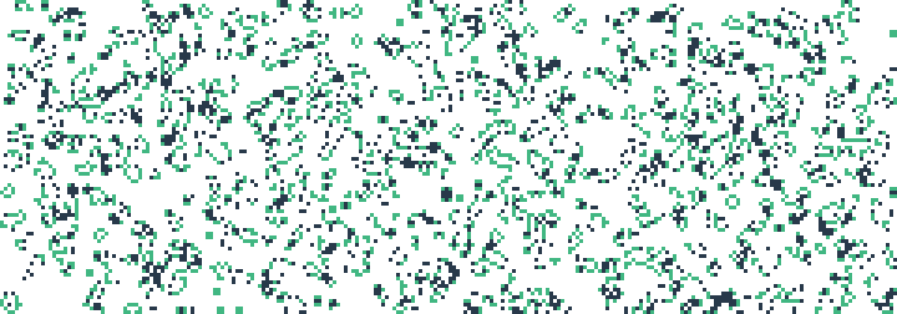

<div id="top"></div>

<p>
	
</p>

<br/>
<div align="center">
	<h2 align="center">GameOfLifeAction</h2>
	<p align="center">
		Github-Action to generate a Game of Life Image in your repository.
		<br/>
		<a href="https://github.com/SilenZcience/GameOfLifeAction/blob/main/GameOfLife/GameOfLife.py">
			<strong>Explore the code »</strong>
		</a>
		<br/>
		<br/>
		<a href="https://github.com/SilenZcience/GameOfLifeAction/issues">Report Bug</a>
		·
		<a href="https://github.com/SilenZcience/GameOfLifeAction/issues">Request Feature</a>
   </p>
</div>


<details>
	<summary>Table of Contents</summary>
	<ol>
		<li>
			<a href="#about-the-project">About The Project</a>
			<ul>
			<li><a href="#made-with">Made With</a></li>
			</ul>
		</li>
		<li>
			<a href="#getting-started">Getting Started</a>
		</li>
		<li><a href="#usage">Usage</a>
			<ul>
			<li><a href="#examples">Examples</a></li>
			</ul>
		</li>
    <li><a href="#local-usage">Local Usage</a>
			<ul>
      <li><a href="#arguments">Arguments</a></li>
			<li><a href="#example">Example</a></li>
			</ul>
		</li>
		<li><a href="#license">License</a></li>
		<li><a href="#contact">Contact</a></li>
	</ol>
</details>

## About The Project

This Project generates a Game-of-Life image and saves it to a path of your choosing.
For each additional time the programm is started, it will read in the image, update its cycle and save it again.
Furthermore it generates and updates an image, which will show the current iteration the game is in.
It will do so for a dark-mode image as well as a light-mode image, which will then be displayed accordingly.

### Made With
[![Python][MadeWith-Python]](https://www.python.org/)
[![Numpy][MadeWith-Numpy]](https://numpy.org/)

<p align="right">(<a href="#top">back to top</a>)</p>

## Getting Started

Choose a folder(-structure), or create a new one, in which the Game-of-Life images should be stored.
<br/>
Within your ``README.md`` add the following element:
```console
<p align="center">
  <picture>
    <source width="98.6%" media="(prefers-color-scheme: dark)" srcset="./<folder>/GameOfLifeDark.png">
    /GameOfLifeBright.png">
  </picture>
  <picture>
    <source width="98.6%" media="(prefers-color-scheme: dark)" srcset="./<folder>/IterationDark.svg">
    /IterationBright.svg">
  </picture>
</p>
```

Additionally add a new ``GameOfLifeAction.yml``-file to your ``./.github/workflows/``-folder within your repository:
```console
name: Update GameOfLife

on:
  schedule:
    - cron: '0 12 */3 * *'
  workflow_dispatch:

env:
  PATH_STRUC: '<folder>'
  COLOR_DEAD_DARK: '#141321FF'
  COLOR_DYING_DARK: '#F7D747FF'
  COLOR_ALIVE_DARK: '#D83A7DFF'
  COLOR_DEAD_LIGHT: '#FFFEFEFF'
  COLOR_DYING_LIGHT: '#28394AFF'
  COLOR_ALIVE_LIGHT: '#41B782FF'
  CANVAS_HEIGHT: '420'
  CANVAS_WIDTH: '1200'
  CELL_AMOUNT_VERTICAL: '84'
  CELL_AMOUNT_HORIZONTAL: '240'

jobs:
  build:
    runs-on: ubuntu-latest
    steps:
      - name: Checkout
        uses: actions/checkout@v3
        with:
          path: main
      - name: Checkout GameOfLifeAction - Repo
        uses: actions/checkout@v3
        with:
          repository: SilenZcience/GameOfLifeAction
          path: GameOfLifeAction
      - name: Install Python
        uses: actions/setup-python@v4
        with:
          python-version: "3.10"
      - name: Setup Dependencies
        run: |
          python -m pip install --upgrade pip
          python -m pip install -r ./GameOfLifeAction/GameOfLife/requirements.txt
      - name: Run Script
        run: |
          python ./GameOfLifeAction/GameOfLife/GameOfLife.py -p "./main/$PATH_STRUC" \
          -cdead "$COLOR_DEAD_LIGHT,$COLOR_DEAD_DARK" \
          -cdying "$COLOR_DYING_LIGHT,$COLOR_DYING_DARK" \
          -calive "$COLOR_ALIVE_LIGHT,$COLOR_ALIVE_DARK" \
          -canvas "$CANVAS_HEIGHT,$CANVAS_WIDTH" \
          -grid "$CELL_AMOUNT_VERTICAL,$CELL_AMOUNT_HORIZONTAL"
      - name: Push
        run: |
          cd ./main/
          git config --local user.name 'github-actions[bot]'
          git config --local user.email 'github-actions[bot]@users.noreply.github.com'
          git add ./$PATH_STRUC/*
          git commit -m "🤖Update GameOfLife"
          git push origin main
```

Thus the following structure is given:
```console
📦Project
 ┣ 📂.github
 ┃ ┗ 📂workflows
 ┃ ┃ ┗ 📜GameOfLifeAction.yml
 ┣ 📂<folder>
 ┗ 📜README.md
```

Replace the ``<folder>`` with your own folder(-structure).
<br/>
You may change the environment variables inside the .yml-file to alternate the colors (RGBA-format),
or switch the canvas size (in pixels) / grid size (in cell-units).
> **Note**: Please note that changing the variables whilst a Game-of-Life image already exists might result in an inaccurate game cycle!

## Usage

The Game-of-Life image will be updated each time you run the GithubAction.
You can specify the ``on``-tag within your workflow .yml-file to define when
the Action will be executed.
<br/>
[Official Documentation on GithubActions](https://docs.github.com/en/actions/using-workflows/workflow-syntax-for-github-actions#on)

### Examples

<p align="center">
	<picture>
		<source width="98.6%" media="(prefers-color-scheme: dark)" srcset="./GameOfLife/images/GameOfLifeDark.png">
		
	</picture>
	<picture>
		<source width="98.6%" media="(prefers-color-scheme: dark)" srcset="./GameOfLife/images/IterationDark.svg">
		
	</picture>
</p>

## Local Usage

You may also use the project locally, by running the command:
```console
git clone git@github.com:SilenZcience/GameOfLifeAction.git
cd ./GameOfLifeAction
```
```console
python .\GameOfLife\GameOfLife.py [OPTION]...
```

### Arguments

- `-h, --help`
  - show help message and exit
- `-p PATH, --path PATH`
  - specify output folder
  - default value: GameOfLife directory containing the executed file
  - target files: PATH/GameOfLifeBright.png & PATH/GameOfLifeDark.png
- `-cdead CDEAD`
  - the colors for dead cells, format: #light,#dark
  - default value: "#FFFEFEFF,#141321FF"
  - alpha value is by default "FF", it is not neccessary to specify.
  - when generating gifs the alpha value has to be "FF"
  - only specifying #light will result in "#light,#light"
- `-cdying CDYING`
  - the colors for dying cells, format: #light,#dark
  - default value: "#28394AFF,#F7D747FF"
  - alpha value is by default "FF", it is not neccessary to specify.
  - when generating gifs the alpha value has to be "FF"
  - only specifying #light will result in "#light,#light"
- `-cdead CALIVE`
  - calive colors for dead cells, format: #light,#dark
  - default value: "#41B782FF,#D83A7DFF"
  - alpha value is by default "FF", it is not neccessary to specify.
  - when generating gifs the alpha value has to be "FF"
  - only specifying #light will result in "#light,#light"
- `canvas CANVAS`
  - canvas size in pixel, format: height,width
  - default value: "420,1200"
  - if the taget files already exist, the image shape will be used
- `-grid GRID`
  - grid size in cells, format: vertical,horizontal
  - default value: "84,240"
  - the cellsize in pixels will be calculated by CANVAS/GRID
- `-gif GIF`
  - create a gif of 'gifLength' for a given image with the #light color-palette
  - expects a filepath as parameter
  - the gif will append a mirrored version of itself to create an endless loop
  - allowed file types: '.BMP', '.JPEG', '.PNG', '.SPIDER', '.TIFF', '.GIF'
- `-gifLength GIFLENGTH`
  - set the amount of frames for the gif
  - default value: 10
- `-gifSpeed GIFSPEED`
  - set the gif speed in ms
  - default value: 100
- `-from FROM`
  - make a transition from this file
  - allowed file types: '.BMP', '.JPEG', '.PNG', '.SPIDER', '.TIFF', '.GIF'
- `-to TO`
  - make a transition to this file
  - allowed file types: '.BMP', '.JPEG', '.PNG', '.SPIDER', '.TIFF', '.GIF'

### Example

```console
python .\GameOfLife\GameOfLife.py -gif .\GameOfLife\images\GameOfLife.png -cdead '#0D1117' -calive '#8A939D' -grid "210,600" -gifLength 50
```


## License

This project is licensed under the MIT License - see the [LICENSE](https://github.com/SilenZcience/GameOfLifeAction/blob/main/LICENSE) file for details

## Contact

> **SilenZcience** <br/>
[![GitHub-SilenZcience][GitHub-SilenZcience]](https://github.com/SilenZcience)

[MadeWith-Python]: https://img.shields.io/badge/Made%20with-Python-brightgreen
[MadeWith-Numpy]: https://img.shields.io/badge/Made%20with-Numpy-brightgreen

[GitHub-SilenZcience]: https://img.shields.io/badge/GitHub-SilenZcience-orange
